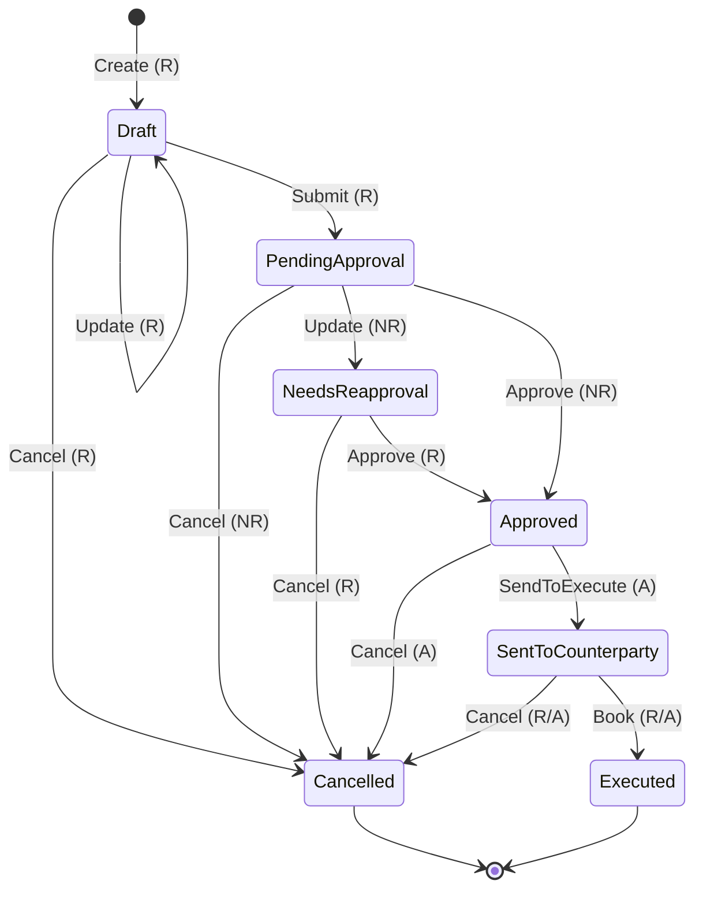
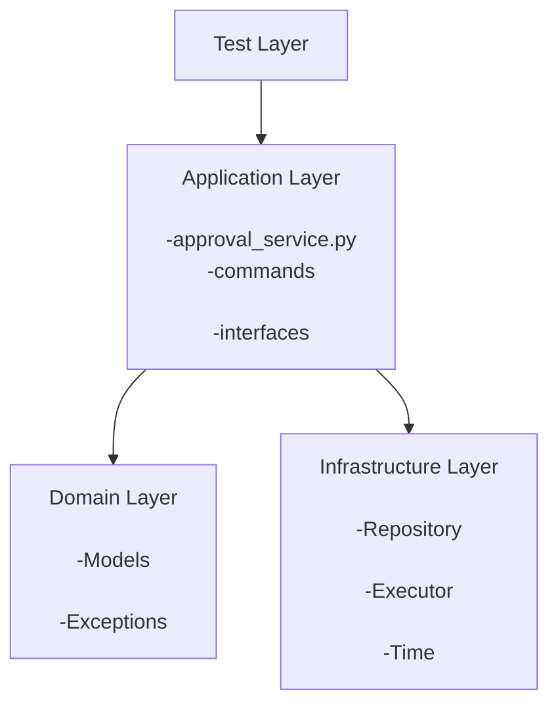

## Trade Approval Workflow

> **Authorization Legend:**  
> R = Requester. Anyone can do it. 
> NR = Non-requester. Anyone except requester can do it. 
> A = Approver. Requester if NeedsReapproval was involved, otherwise None-requester 
> R/A = both Requester and Approver can do it, but noone else 

## Layer diagram 

| **State**                  | **Action**        | **Transition**                    | **Input**                                   | **Assumptions**                                                                                                                                                              |
| -------------------------- | ----------------- | --------------------------------- | ------------------------------------------- | ---------------------------------------------------------------------------------------------------------------------------------------------------------------------------- |
| *(Trade not exists yet)* | **Create**        | → Draft                           | Requester UserId + TradeDetails             | 1️⃣ Requester can be anyone (no dedicated role). 2️⃣ TradeDetails must be validated. 3️⃣ Trade saved to database as the first version.                                 |
| **Draft**                  | **Submit**        | Draft → PendingApproval           | Requester UserId + TradeDetails             | 1️⃣ Only the Requester can submit their own draft. 2️⃣ No re-validation needed. 3️⃣ Trade saved to database as a new version.                                          |
| **Draft**                  | **Update**        | Draft → Draft                     | Requester UserId + TradeDetails             | 1️⃣ Only the Requester can update their own draft. 2️⃣ Cannot update after submission. 3️⃣ TradeDetails must be re-validated. 4️⃣ Trade saved as new version.       |
| **Draft**                  | **Cancel**        | Draft → Cancelled                 | Requester UserId                            | 1️⃣ Only the Requester can cancel their own draft.                                                                                                                           |
| **PendingApproval**        | **Approve**       | PendingApproval → Approved        | Approver UserId                             | 1️⃣ Approver = anyone except Requester. 2️⃣ No re-validation. 3️⃣ Trade saved as new version.                                                                          |
| **PendingApproval**        | **Update**        | PendingApproval → NeedsReapproval | Approver UserId + TradeDetails              | 1️⃣ Approver (not Requester) can update. 2️⃣ TradeDetails must be re-validated. 3️⃣ Trade saved as new version.                                                        |
| **PendingApproval**        | **Cancel**        | PendingApproval → Cancelled       | Approver UserId                             | 1️⃣ Approver (not Requester) can cancel. 2️⃣ Requester can cancel only drafts, not pending trades. 3️⃣ Trade saved as new version.                                     |
| **NeedsReapproval**        | **Approve**       | NeedsReapproval → Approved        | Requester UserId                            | 1️⃣ Original Requester approves the Approver’s change. 2️⃣ No re-validation. 3️⃣ Trade saved as new version.                                                           |
| **NeedsReapproval**        | **Cancel**        | NeedsReapproval → Cancelled       | Requester UserId                            | 1️⃣ Approver (not Requester) can cancel. 2️⃣ Requester can cancel only drafts, not pending trades. 3️⃣ Trade saved as new version.                                     |
| **Approved**               | **SendToExecute** | Approved → SentToCounterparty     | Actual Approver UserId                      | 1️⃣ Actual Approver = Approver of PendingApproval or NeedsReapproval (Requester). 2️⃣ Only Approver can send. 3️⃣ No re-validation. 4️⃣ Trade saved as new version. |
| **Approved**               | **Cancel**        | Approved → Cancelled              | Requester UserId                            | 1️⃣ Approver (not Requester) can cancel. 2️⃣ Requester can cancel only drafts. 3️⃣ Trade saved as new version.                                                         |
| **SentToCounterparty**     | **Book**          | SentToCounterparty → Executed     | Requester or Approver UserId + Confirmation | 1️⃣ Both Requester and Approver can book. 2️⃣ No re-validation. 3️⃣ Trade saved as new version.                                                                        |
| **SentToCounterparty**     | **Cancel**        | SentToCounterparty → Cancelled    | Requester or Approver UserId                | 1️⃣ Both Requester and Approver can cancel. 2️⃣ Trade saved as new version.                                                                                               |

